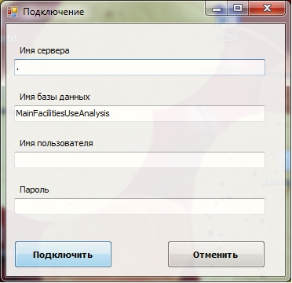
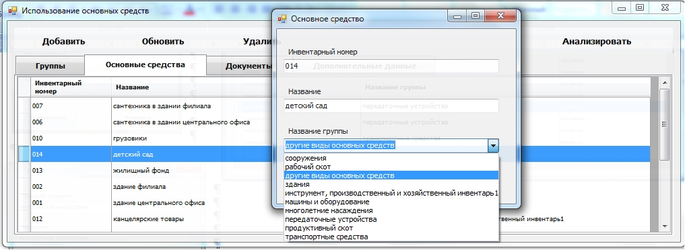
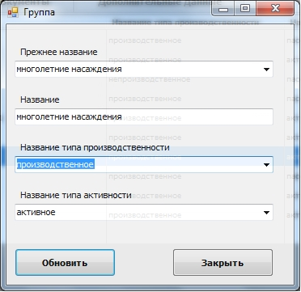
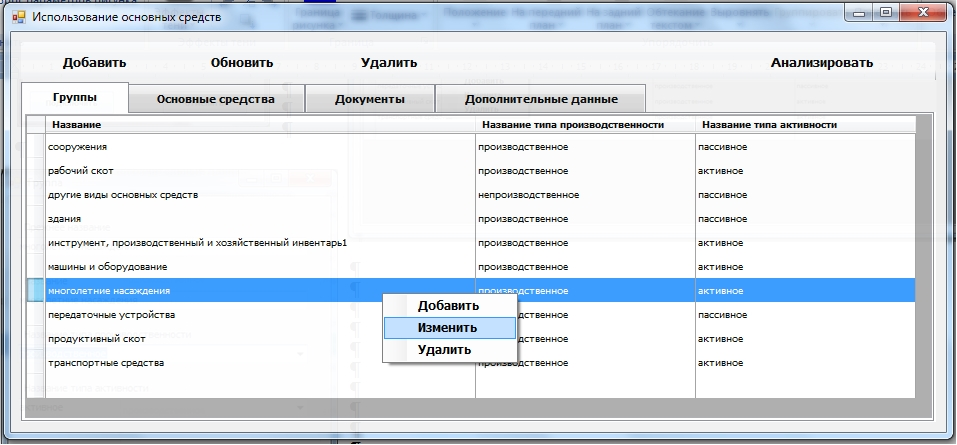
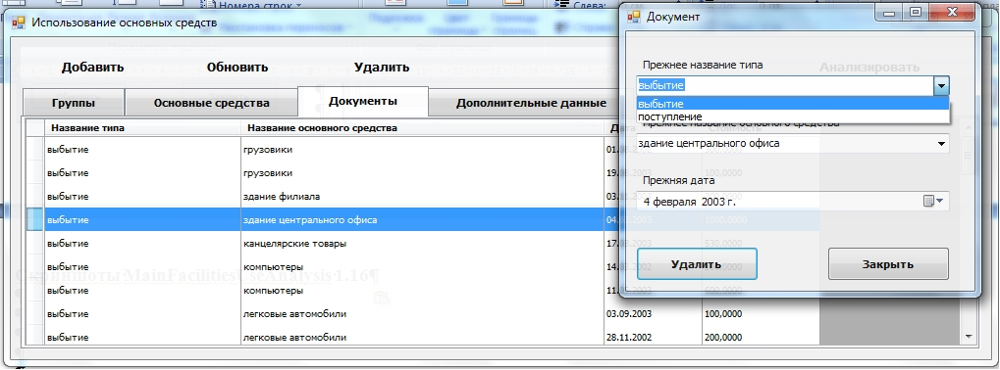
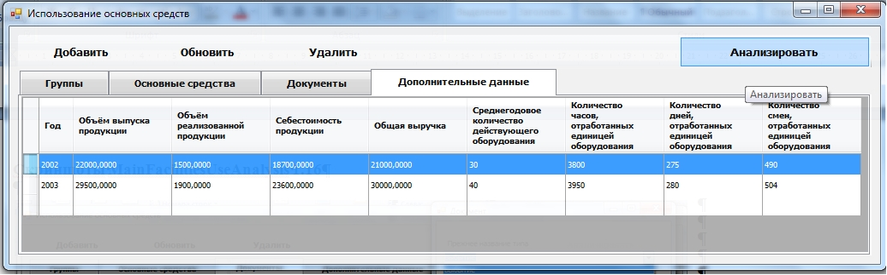
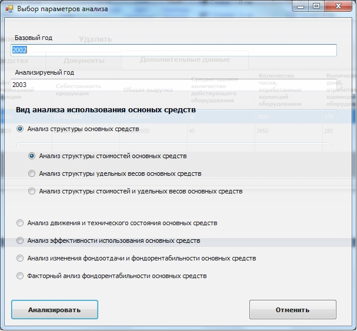
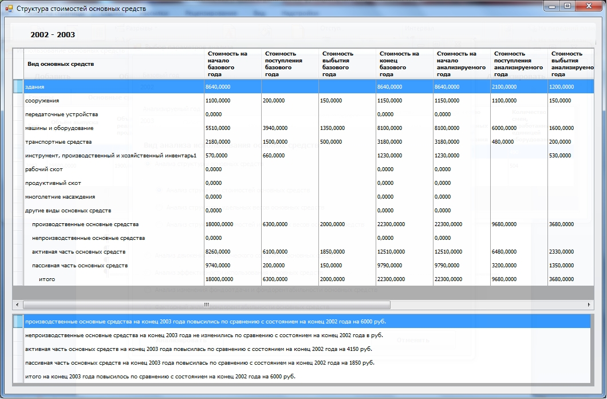
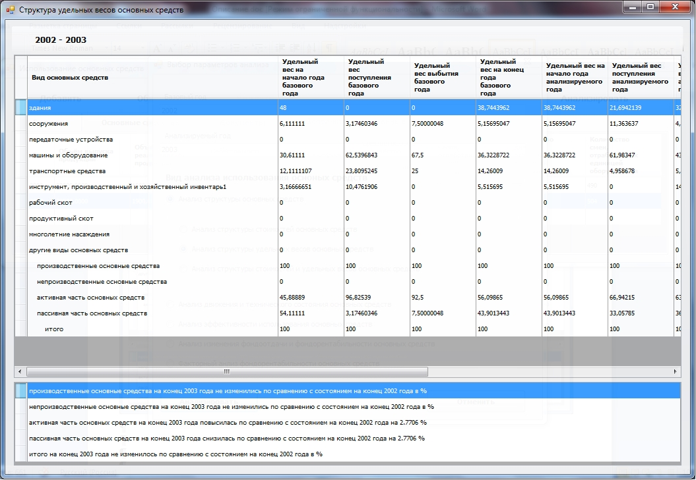
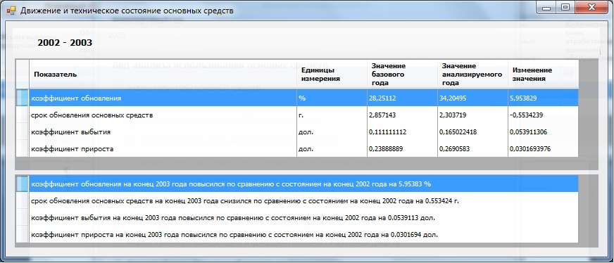

# База данных и приложение "Анализ эффективности использования основных производственных средств" (MainFacilitiesUseAnalysis)

## Средства разработки
- **Языки программирования**: Transact-SQL, C#.
- **СУБД**: Microsoft SQL Server 2012.
- **Среда разработки**: Microsoft Visual Studio.

## Описание программы
Основные средства являются неотъемлемой частью предприятия и от повышения эффективности их использования зависят важные показатели деятельности предприятия, такие как финансовое положение, конкурентоспособность на рынке.

Посредством хранимых подпрограмм база данных рассчитывает и анализирует коэффициенты, а также предоставляет клиентскому приложению доступ к данным для их редактирования и отображения.
Коэффициенты рассчитываются специализированными хранимыми функциями базы данных, при помощи которых формируются динамические таблицы коэффициентов с заданными параметрами, что является результатом анализа использования основных средств.

## Статус проекта
Проект завершён.

## Контакты
Котова Екатерина Александровна,
e-mail: katekotova_86@mail.ru
